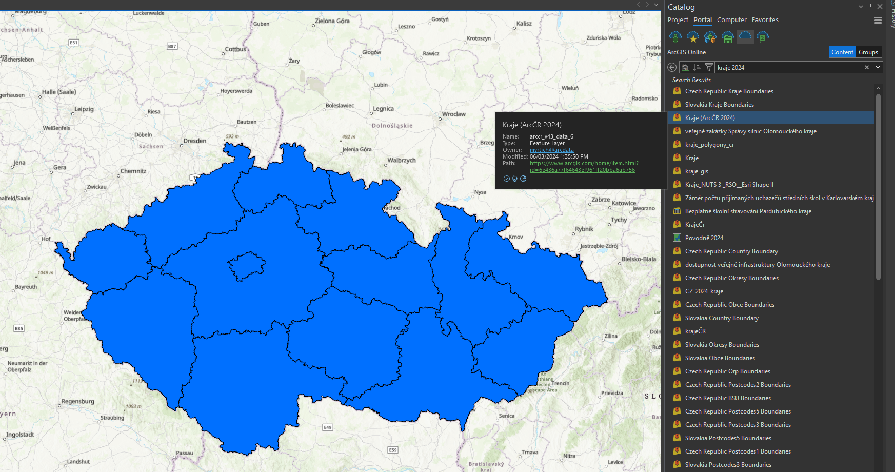
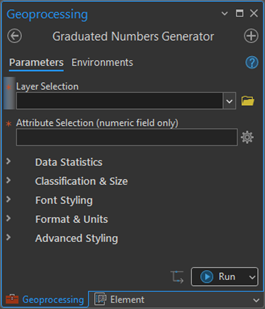
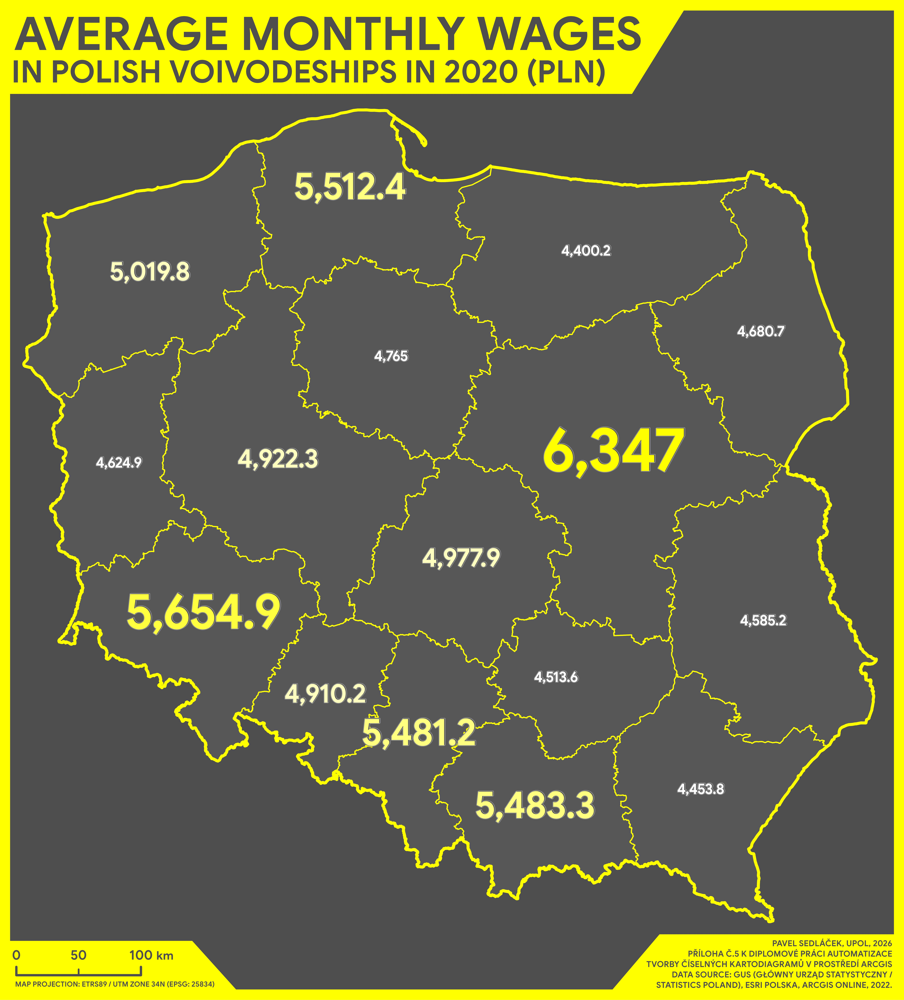
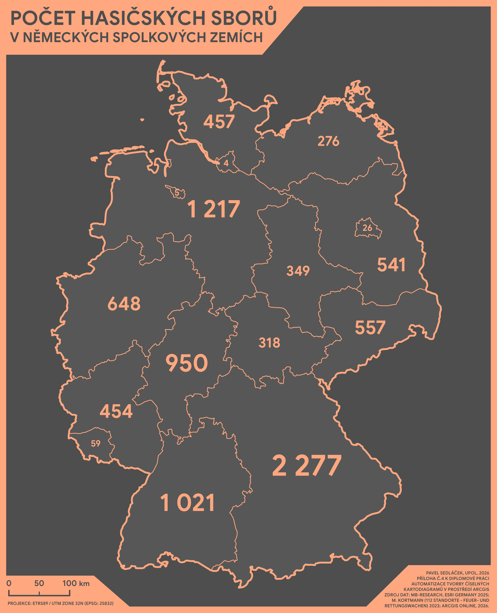
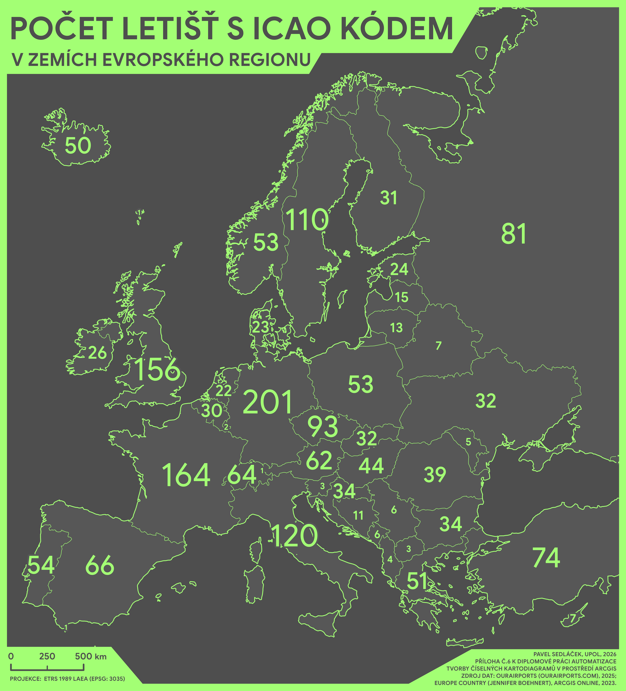

# Graduated Numbers Generator for ArcGIS Pro

A geoprocessing toolbox (`.atbx`) for ArcGIS Pro that automates the creation of graduated number map method — a cartographic method where numeric values are visualised directly as styled labels with smooth gradation of size, colour, and font weight.

**IMPORTANT: This toolbox is supported in ArcGIS Pro 3.3 and newer.**

Developed as part of a master's thesis at the Department of Geoinformatics, Palacký University Olomouc (2026).

## About the Tool

ArcGIS Pro has no built-in support for graduated number map. This tool fills that gap by automating the entire workflow — classification, label generation, and advanced typographic styling — through a single parameterized toolbox with 36 parameters organised into five sections:

- **Data Statistics** — field selection and statistical overview
- **Classification & Size** — classification method, number of classes, size range
- **Font Styling** — font family, weight, colour gradients, variable font support
- **Format & Units** — number formatting, units, label offsets
- **Advanced Styling** — halo, shadow, underline, wrapping control

The tool does not modify the source data. It uses a custom module connected to the Windows registry to read installed system fonts, and generates Arcade expressions for dynamic label formatting.

Sample data for the examples are accessed directly from ArcGIS Portal / ArcGIS Online (no local data download is required).

## About the Thesis

This tool was developed as part of the master's thesis:

> SEDLÁČEK, Pavel. *Automatizace tvorby číselných kartodiagramů v prostředí ArcGIS*. Palacký University Olomouc, Faculty of Science, Department of Geoinformatics, 2026. Supervisor: Mgr. Radek Barvíř, Ph.D.
> 
> Full thesis: https://www.geoinformatics.upol.cz/dprace/magisterske/sedlacek26/

A detailed thesis summary is available in [`docs/thesis-summary.md`](docs/thesis-summary.md).

## Repository Structure

- `toolbox/` — the `.atbx` toolbox file ready to load in ArcGIS Pro
- `src/` — standalone Python scripts `Execution.py` and `Validation.py`
- `docs/` — thesis summary and repository documentation
- `examples/` — sample maps and screenshots of the tool in action
- `sample-data/` — information about the datasets used in the examples

## Sample Data (ArcGIS Portal)

Sample datasets used in this project are hosted externally in ArcGIS Portal / ArcGIS Online. They are not redistributed in this repository.

Source citation (example dataset used in this repository): **ARCDATA PRAHA, ZÚ, ČSÚ - Kraje (ArcČR 2024), Česká republika, (ArcGIS Online).**

To get working data quickly in ArcGIS Pro:

1. Open the **Catalog** pane and switch to **Portal** (or use [ArcGIS Online](https://www.arcgis.com)).
2. Search for one of the datasets listed in [`sample-data/README.md`](sample-data/README.md) (for example: `Kraje (ArcČR 2024)`).
3. Add the hosted feature layer to your map.
4. Run the toolbox on that layer and select a numeric attribute.

Example of searching and adding the Czech regional boundary dataset from Portal in ArcGIS Pro.

## Tool Interface

**Collapsed:**

Tool interface immediately after initialization.

**Expanded:**

Example of the fully expanded tool with default parameter values, active gradients, and a selected input layer and attribute.

## How to Use

1. Open ArcGIS Pro.
2. Load the `.atbx` toolbox from the `toolbox/` folder.
3. Select your layer and numeric attribute field.
4. Configure classification, sizing, and styling parameters.
5. Run the tool — labels are applied directly to the map.

If needed, the source logic is documented in `src/` for reference or modification.

## Example Maps

**Czech Republic — Number of Women and Men by Region (2021, thousands)**

**Poland — Average Monthly Wages by Voivodeship (2020, PLN)**

**Germany — Number of Fire Brigades by Federal State**

**Europe — Number of Airports with an ICAO Code by Country**

